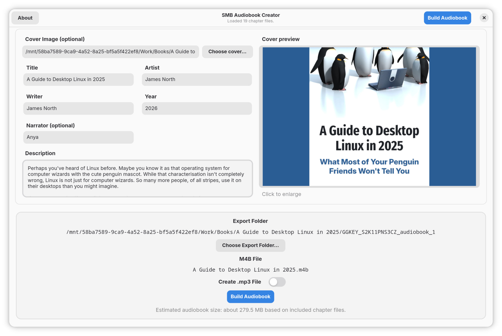
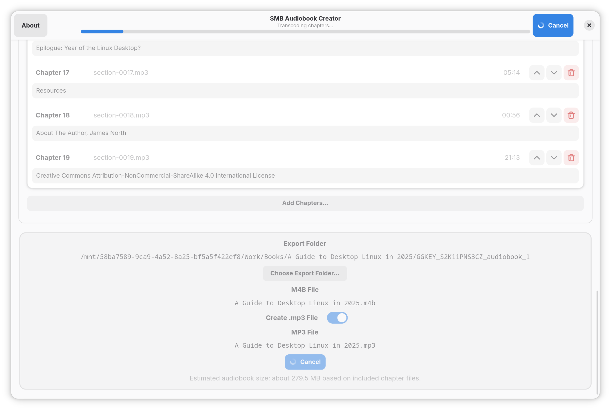
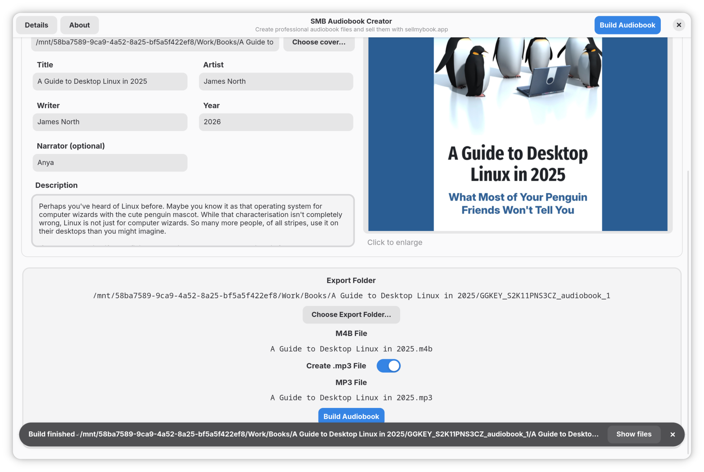

# SMB Audiobook Creator

SMB Audiobook Creator is a desktop app for building chapterized `.m4b` and `.mp3`
audiobooks from source audio files. It is the official audiobook production tool for
sellmybook.app.

Built with Python, GTK4, and Libadwaita. Uses FFmpeg, FFprobe, and tone for media work.

Licensed under the Apache License 2.0.

This app works on macOS & Linux via Flatpak.

## Features

* Automatically load all audio chapter files from a folder
* Create an .m4b file with rich metadata combining all chapter files for use in
  Audiobook players
* Create an .mp3 copy with all the same metadata as the .m4b file
* Add/Change chapter title metadata
* Add new audio files from other folders
* Reorder chapters
* Exclude chapters from the final bundled audiobook file
* Estimates how large the final audiobook file will be
* Automatically detects publication.json files and maps metadata to chapter
  files (useful for Audiobooks from Google Books)

## Screenshots

### Book Details



### Build Progress



### Completed Build



## License notices

SMB Audiobook Creator includes and invokes the `ffmpeg` and `ffprobe` binaries from an
LGPL-configured build of the FFmpeg project, uses `libmp3lame` as a separate third-party
library, and bundles `tone` for audiobook metadata tagging.

See [LICENSE](LICENSE) and [THIRD_PARTY_NOTICES.md](THIRD_PARTY_NOTICES.md).

## Build prerequisites

Install Flatpak and the required runtimes:

```bash
flatpak install flathub org.gnome.Platform//50 org.gnome.Sdk//50 org.freedesktop.Sdk.Extension.dotnet8//24.08
```

## Build locally

```bash
flatpak-builder --user --install --force-clean build-dir app.sellmybook.SMBAudiobookCreator.yml
```

Run it:

```bash
flatpak run app.sellmybook.SMBAudiobookCreator
```

## Create a single-file bundle

```bash
flatpak-builder --repo=repo --force-clean build-dir app.sellmybook.SMBAudiobookCreator.yml
flatpak build-bundle repo smb-audiobook-creator.flatpak app.sellmybook.SMBAudiobookCreator
```
